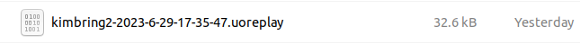

# UoService


UoService is a service to play Ultima Online through gRPC. There are first-class Python bindings and examples, so you can play Ultima Online as you would use the OpenAI gym API.

# Architecture


# System requirement
- Currently, I only test this project in Ubuntu linux.
- You need to install the [Ultima Online game](https://uo.com/client-download/) itself through the [Wine](https://wiki.winehq.org/Ubuntu).

# Quick Start Guide
## Get UoService

The easiest way to get UoService is to use pip:

```
$ git clone https://github.com/kimbring2/uoservice
$ cd uoservice
$ pip install .
```

That will install the UoService package along with all the required dependencies. Virtualenv can help manage your dependencies. You may also need to upgrade pip: ```pip install --upgrade pip``` for the UoService installs to work.

# Get Server and gRPC client of Ultima Online
Because Ultime Online is an MMORPG game, there is basically a central server. To run UoService, a server must be installed as well. Please visit the [ServUO site](https://github.com/ServUO/ServUO) and set up the server.

Next, you need to build a modified ClassicUO client from [PyUO repository](https://github.com/kimbring2/pyuo).

Because UoService does not have the function to create an account on its own, you must create an account using the original ClassicUO before using the modified client.

Finally, some values ​​inside ```settings.json``` must be changed according to the location where ServeUO and Ultima Online game are installed with Ubuntu [Wine](https://wiki.winehq.org/Ubuntu).


# Run an agent 
- Make sure to run the ServeUO before running the client.
```
$ mono ServUO.exe
```

- Run the modified ClassicUO client with [various argument options](https://github.com/kimbring2/pyuo/blob/main/README.md#run-code).

  **1. Human Play with no Python connection(No replay recording)**
  
  

  To reduce complexity, the Login, Shard Selection, and Character Selection screens are skipped unlike the original ClassicUO client. Furthermore, first character of the account is automacially selected.

  **2. Python connection through the gRPC(No replay recording)**
  - Run the [sample Python code](https://github.com/kimbring2/uoservice/blob/main/uoservice/examples/semaphore_sync.py).
  ```
  $ python examples/semaphore_sync.py --grpc_port [gRPC port of C# side] --uo_installed_path [EA UO installed path on Wine]"
  
  e.g. $ python examples/semaphore_sync.py --grpc_port 60051 --uo_installed_path "/home/kimbring2/.wine/drive_c/Program Files (x86)/Electronic Arts/Ultima Online Classic"
  ```

  

  In Human Play of step 1, the agent information is obtained through the game screen. Then, agent is controlled via the mouse. However, this process is substituted through code in case of the Python connecting mode.

  **3. Replay Recording(Human Play with no Python connection)**
  
  
  
  Finally, the record will be stored as a replay file if the replay argument is added to Human Play mode. That files are automatically created and saved in the subfolder of the exe file folder per a certain game tick pass.

# Parse the replay file
- If you play as a human in the ClassicUO client, replay files are saved at set intervals the as shown below. You can read this into Python and visualize the information.


Run the [sample Python code](https://github.com/kimbring2/uoservice/blob/main/uoservice/examples/main_replay.py).

```
$ python examples/main_replay.py --replay_path [root path of replay file] --uo_installed_path [EA UO installed path on Wine] --file_name [Actual file name of replay]

e.g. $ python3.7 examples/main_replay.py --replay_path /home/kimbring2/ClassicUO/bin/dist/Replay --uo_installed_path "/home/kimbring2/.wine/drive_c/Program Files (x86)/Electronic Arts/Ultima Online Classic" --file_name kimbring2-2023-7-28-06-01-02
```
