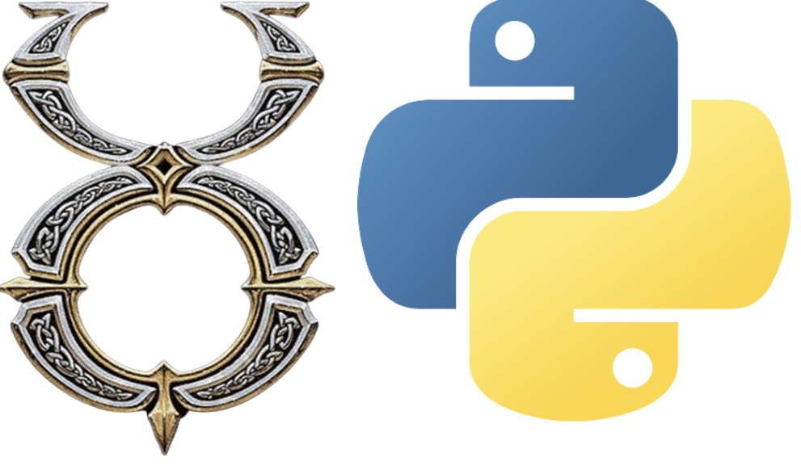

# UoService


UoService is a service to play Ultima Online through gRPC. There are first-class Python bindings and examples, so you can play Ultima Online as you would use the OpenAI gym API.

# Code Architecture


# Quick Start Guide
## Get UoService

The easiest way to get UoService is to use pip:

```
$ git clone https://github.com/kimbring2/uoservice
$ cd uoservice
$ pip install .
```

That will install the UoService package along with all the required dependencies. Virtualenv can help manage your dependencies. You may also need to upgrade pip: ```pip install --upgrade pip``` for the UoService installs to work.

# Get Server and gRPC client of Ultima Online
Because Ultime Online is an MMORPG game, there is basically a central server. To run UoService, a server must be installed as well. Please visit the [ServUO site](https://github.com/ServUO/ServUO) and set up the server.

Next, you need to download a modified ClassicUO client in which the gRPC part is added to the original form [Google Drive](https://drive.google.com/drive/folders/1TmCqpcy5JBNN3zS5C5gE6nSCr_-vv23q?usp=sharing).

Since UoService does not have the function to create an account on its own, you must create an account using the original ClassicUO before using the modified client.

Finally, some values ​​inside ```settings.json``` must be changed according to the location where ServeUO and Ultima Online game are installed with Ubuntu [Wine](https://wiki.winehq.org/Ubuntu).


# Run an agent 
Make sure to run the ServeUO before running the client.
```
$ mono ServUO.exe
```

Unlike the original client, the client for UoService must operate most of the operations through argument setting.

## 1. No gRPC communication with Python, No replay saving
Run the C# Client. You must enter the ID and pwd of the previously created account as parameters. Login, shard selection, and character selection windows are omitted.
```
$ ./ClassicUO -username [Account ID] -password [Account PWD] -human_play -window_width [Screen Width] -window_height [Screen Height]
e.g. $ ./ClassicUO -username kimbring2 -password kimbring2 -human_play -window_width 1370 -window_height 1280
```

## 2. Communication with Python, No replay saving
Run the C# Client. Here, you need to enter the port for gRPC communication with Python.
```
$ ./ClassicUO -username [Account ID] -password [Account PWD] -grpc_port [Port Number]
e.g.  $ ./ClassicUO -username kimbring2 -password kimbring2 -human_play -window_width 1370 -window_height 1280 -grpc_port 60051
```

Run the [sample Python Application](https://github.com/kimbring2/uoservice/blob/main/uoservice/examples/semaphore_sync.py).
```
$ python examples/semaphore_sync.py --grpc_port 60051
```

## 3.No gRPC communication with Python, Replay saving
```
$ ./ClassicUO -username [Account ID] -password [Account PWD] -window_width [Screen Width] -window_height [Screen Height] -replay
e.g. ./ClassicUO -username kimbring2 -password kimbring2 -human_play -window_width 1370 -window_height 1280 -replay
```
